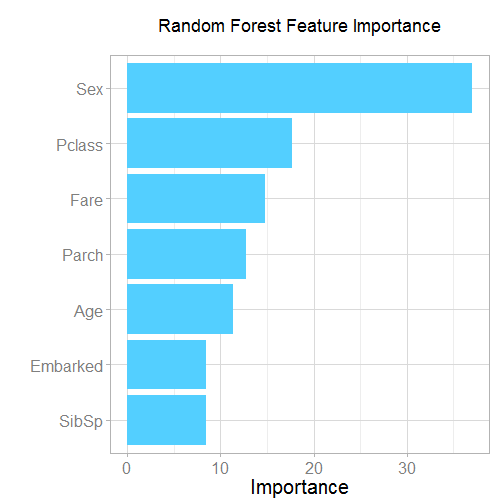
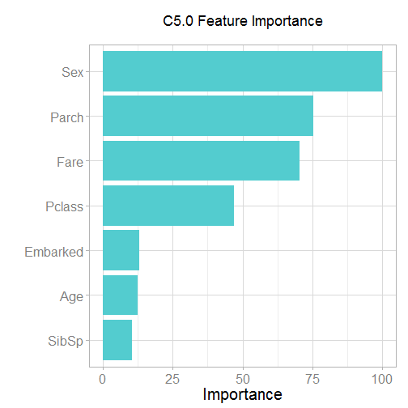

Titanic: Machine Learning from Disaster
========================================================
author: Vincent Terrasi
date: 13/06/2015

Predict survival on the Titanic 
========================================================

On April 15, 1912, during her maiden voyage, the Titanic sank after colliding with an iceberg, killing 1502 out of 2224 passengers and crew. This sensational tragedy shocked the international community and led to better safety regulations for ships.

One of the reasons that the shipwreck led to such loss of life was that there were not enough lifeboats for the passengers and crew. Although there was some element of luck involved in surviving the sinking, some groups of people were more likely to survive than others, such as women, children, and the upper-class.

I am going to apply the tools of machine learning to predict which passengers survived the tragedy.

Variable Descriptions
========================================================

- survival | Survival (0 = No; 1 = Yes)
- pclass   | Passenger Class (1 = 1st; 2 = 2nd; 3 = 3rd)
- name     | Name
- sex      | Sex
- age      | Age
- sibsp    | Number of Siblings/Spouses Aboard
- parch    | Number of Parents/Children Aboard
- ticket   | Ticket Number
- fare     | Passenger Fare
- cabin    | Cabin
- embarked | Port of Embarkation (C = Cherbourg; Q = Queenstown; S = Southampton)

Analyse Data
========================================================


```r
extractFeatures <- function(data) {
  features <- c("Pclass",
                "Age",
                "Sex",
                "Parch",
                "SibSp",
                "Fare",
                "Embarked")
  fea <- data[,features]
  fea$Age[is.na(fea$Age)] <- -1
  fea$Fare[is.na(fea$Fare)] <- median(fea$Fare, na.rm=TRUE)
  fea$Embarked[fea$Embarked==""] = "S"
  fea$Sex      <- as.factor(fea$Sex)
  fea$Embarked <- as.factor(fea$Embarked)
  return(fea)
}
```

Using Random Forest
========================================================

 

Using Classifier C5
========================================================

 

Conclusion
========================================================
We can have very different results between two algorithms of Machine Learning.

Be careful to use the good algorithm and always parse and check your input data.

